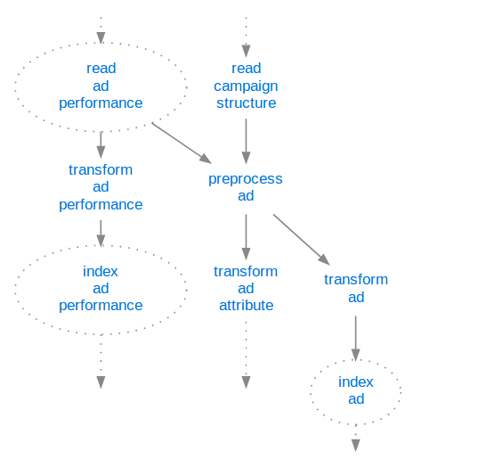
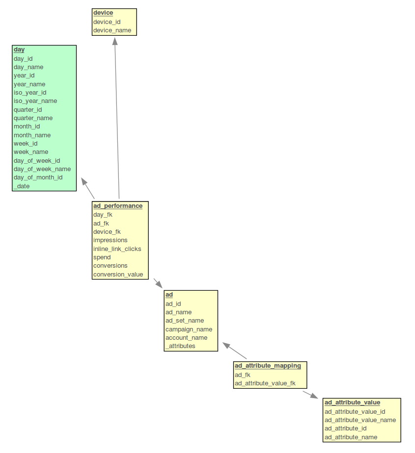

# Facebook Ads Performance Pipeline

A small [mara data integration pipeline](https://github.com/mara/data-integration) that incrementally loads the files downloaded by the [mara Facebook ads performance downloader](https://github.com/mara/facebook-ads-performance-downloader) into a PostgreSQL data warehouse and transforms the data into a dimensional schema.




## Resulting data

The pipeline (defined in [facebook_ads_performance_pipeline/__init__.py](facebook_ads_performance_pipeline/__init__.py)) creates a database schema `fb_dim` that contains an `ad_performance` fact table with the dimensions `time`, `ad` and `device`:

 

&nbsp;

This is an example row of the fact table:

```sql
select * from fb_dim.ad_performance where conversions > 0 order by random() limit 1;
-[ RECORD 1 ]------+------------------
day_fk             | 20180924
ad_fk              | 23844375245730149
device_fk          | 1
impressions        | 1226
inline_link_clicks | 47
spend              | 33.47
conversions        | 8
conversion_value   | 1137.68
```

See [Ads Insights - Parameters](https://developers.facebook.com/docs/marketing-api/insights/parameters) for a documentation of the metrics.

&nbsp;


## Getting started

Add 

```
-e git+git@github.com:mara/facebook-ads-performance-pipeline.git@1.0.0#egg=facebook_ads_performance_pipeline
```

to the `requirements.txt` of your mara project. See the [mara example project](https://github.com/mara/mara-example-project) for details.
 
Make sure that your ETL contains the [etl_tools/create_time_dimensions/](https://github.com/mara/etl-tools/blob/master/etl_tools/create_time_dimensions/__init__.py) pipeline for creating the `time.day` dimension.

Then add the pipeline to your ETL with

```python
import facebook_ads_performance_pipeline

my_pipeline.add(facebook_ads_performance_pipeline.pipeline)
```
